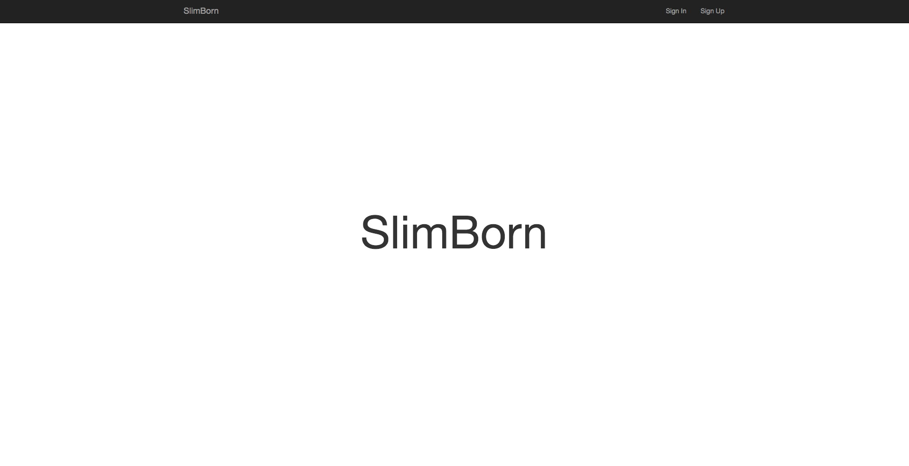

# slim-born
[](https://scrutinizer-ci.com/g/HavenShen/slim-born/?branch=master)
[](https://scrutinizer-ci.com/g/HavenShen/slim-born/build-status/master)
[](https://scrutinizer-ci.com/g/HavenShen/slim-born/?branch=master)
[](https://travis-ci.org/HavenShen/slim-born)
[](https://packagist.org/packages/HavenShen/slim-born)
[](https://packagist.org/packages/HavenShen/slim-born)
[](https://packagist.org/packages/HavenShen/slim-born)
[](https://packagist.org/packages/HavenShen/slim-born)
[](https://packagist.org/packages/HavenShen/slim-born)

> Slim Framework 3 skeleton application has authentication MVC construction.

The user authentication has been achieved, there is a need to install and use.

## Installation

```shell
composer create-project havenshen/slim-born [my-app]
```

## .env

Copy file .env.example to .env

```
DB_DRIVER=mysql
DB_HOST=localhost
DB_DATABASE=slimborn
DB_USERNAME=root
DB_PASSWORD=
DB_PORT=3306
```

## Router

This is a Slim Framework  Router.
Reference - [Slim Router](http://www.slimframework.com/docs/objects/router.html)

```php
<?php

$app->get('/', 'HomeController:index')->setName('home');

$app->group('', function () {
	$this->get('/auth/signup', 'AuthController:getSignUp')->setName('auth.signup');
	$this->post('/auth/signup', 'AuthController:postSignUp');

	$this->get('/auth/signin', 'AuthController:getSignIn')->setName('auth.signin');
	$this->post('/auth/signin', 'AuthController:postSignIn');
})->add(new GuestMiddleware($container));
```

## Controller

Use Slim Framework Twig View.
Reference - [Twig-View](https://github.com/slimphp/Twig-View)

```php
<?php

namespace App\Controllers;

class HomeController extends Controller
{
	public function index($request, $response)
	{
		return $this->view->render($response, 'home.twig');
	}
}
```

## Model

Use Laravel PHP Framework Eloquent.
Reference - [illuminate/database](https://github.com/illuminate/database)
```php
<?php

namespace App\Models;
use Illuminate\Database\Eloquent\Model;

class User extends Model
{
	protected $table = 'users';

	protected $fillable = [
		'email',
		'name',
		'password',
	];

	public function setPassword($password)
	{
		$this->update([
			'password' => password_hash($password, PASSWORD_DEFAULT)
		]);
	}
}
```

## Middleware

```php
<?php

namespace App\Middleware;

class AuthMiddleware extends Middleware
{
	public function __invoke($request, $response, $next)
	{
		if(! $this->container->auth->check()) {
			$this->container->flash->addMessage('error', 'Please sign in before doing that');
			return $response->withRedirect($this->container->router->pathFor('auth.signin'));
		}

		$response = $next($request, $response);

		return $response;
	}
}
```

## Validation

Use the most awesome validation engine ever created for PHP.
Reference - [Respect/Validation](https://github.com/Respect/Validation)
```php
<?php

namespace App\Controllers\Auth;
use App\Models\User;
use App\Controllers\Controller;
use Respect\Validation\Validator as v;

class AuthController extends Controller
{
	public function postSignUp($request, $response)
	{
		$validation = $this->validator->validate($request, [
			'email' => v::noWhitespace()->notEmpty()->email()->emailAvailable(),
			'name' => v::noWhitespace()->notEmpty()->alpha(),
			'password' => v::noWhitespace()->notEmpty(),
		]);

		if ($validation->failed()) {
			return $response->withRedirect($this->router->pathFor('auth.signup'));
		}

		//	todo someting
	}
}
```

## More basic functions

reference slim official documents - [Slim Framework](http://www.slimframework.com/docs/)

## Use Packages

* [illuminate/database](https://github.com/illuminate/database) - It also serves as the database layer of the Laravel PHP framework.
* [Respect/Validation](https://github.com/Respect/Validation) - The most awesome validation engine ever created for PHP.
* [slimphp/Slim](https://github.com/slimphp/Slim) - Slim Framework created.
* [slimphp/Slim-Csrf](https://github.com/slimphp/Slim-Csrf) - Slim Framework created.
* [slimphp/Twig-View](https://github.com/slimphp/Twig-View) - Slim Framework created.
* [slimphp/Slim-Flash](https://github.com/slimphp/Slim-Flash) - Slim Framework created.

## Look Feel



## Directory Structure

```shell
|-- slim-born
	|-- app
		|-- Auth
		|-- Controllers
		|-- Middleware
		|-- Models
		|-- Validation
		|-- Routes.php
	|-- bootstrap
		|-- app.php
	|-- public
	|-- resources
	....
```

## Testing

``` bash
$ phpunit
```

## License

The MIT License (MIT). Please see [License File](LICENSE.md) for more information.
